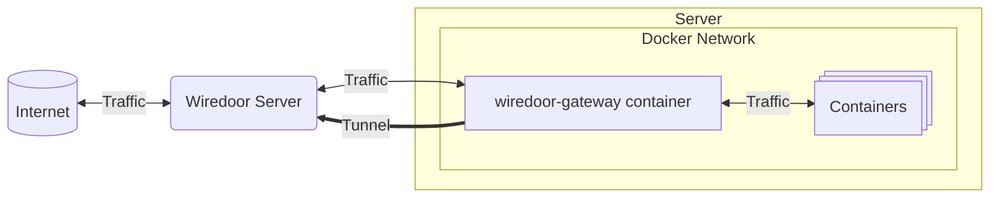

import { Callout } from 'nextra/components'

# Docker Gateway

The **Wiredoor Docker Gateway** is a lightweight container that connects to your Wiredoor Server as a **gateway node**, 
allowing you to expose services from other containers in the same Docker network.

This is especially useful for self-contained Docker stacks where you want to route traffic to one or multiple services.

## Requirements

- [Docker Engine](https://docs.docker.com/engine/install/) installed
- A **Wiredoor Server** deployed and accessible from the host
- A **gateway node** created using the Wiredoor Web UI
  - Should define the **subnet** of the Docker network you want to expose
  - Must have a valid **token**

## How it Works



- The wiredoor-gateway container connects to your Wiredoor Server using the gateway node token.
- It establishes a secure WireGuard VPN tunnel.
- Any service running inside the defined subnet (in this case 172.18.50.0/24) can be exposed through Wiredoor — as long as the gateway container can reach it.

### Service Name Resolution

The `wiredoor-gateway` image includes a preconfigured `dnsmasq` service that allows you to resolve services in your Docker Compose stack by name, 
just like internal DNS inside Docker.

This means that when exposing services through Wiredoor, you don’t need to know the internal IPs of your containers — you can simply use 
their service name (e.g. `wordpress`, `app1`, etc.).

## Exposing services from `docker-compose.yml` stack

Here is a full example using Wiredoor Gateway with multiple services:

```yaml filename="docker-compose.yml" copy
networks:
  wiredoor:
    driver: bridge
    ipam:
      config:
        - subnet: 172.18.50.0/24 # Make sure that this match with Gateway Subnet defined in your wiredoor gateway node
  stack:

services:
  wiredoor-gw:
    image: ghcr.io/wiredoor/wiredoor-cli:latest
    cap_add:
      - NET_ADMIN
    sysctls:
      - net.ipv4.ip_forward=1
    environment:
      WIREDOOR_URL: https://your-wiredoor-instance_or_ip
      TOKEN: your-gateway-node-token
    networks:
      - wiredoor
  
  wordpress:
    image: wordpress
    restart: always
    ports:
      - 8080:80
    environment:
      WORDPRESS_DB_HOST: db
      WORDPRESS_DB_USER: exampleuser
      WORDPRESS_DB_PASSWORD: examplepass
      WORDPRESS_DB_NAME: exampledb
    volumes:
      - wordpress:/var/www/html
    networks:
      - wiredoor
      - stack

  db:
    image: mysql:8.0
    restart: always
    environment:
      MYSQL_DATABASE: exampledb
      MYSQL_USER: exampleuser
      MYSQL_PASSWORD: examplepass
      MYSQL_RANDOM_ROOT_PASSWORD: '1'
    volumes:
      - db:/var/lib/mysql
    networks:
      - stack

volumes:
  wordpress:
  db:
```

<Callout type="warning" emoji="⚠️">
  Only containers in the `wiredoor` network (with subnet 172.18.50.0/24) are reachable through the gateway.
</Callout>

<Callout type="warning" emoji="⚠️">
  Note that in this example, `db` is not reachable because it is only attached to the `stack` network.
</Callout>

<Callout type="info" emoji="🔐">
  For security, consider storing the token in a `.env` file or using Docker Secrets instead of hardcoding it.
</Callout>

### Exposing a Service from the Stack

To expose `wordpress` on port `80`:

- Go to the Wiredoor Web UI → *Expose Service*
- Choose **Protocol**: HTTP
- **Target Host**: `wordpress`
- **Target Port**: `80`
- **Domain**: `blog.example.com`

Wiredoor will securely route requests from `https://blog.example.com` to the internal `wordpress` container.

## Tips and Best Practices

- ✅ Always assign the gateway and target containers to the **same Docker network**
- 🧱 Define a custom subnet to have predictable IPs (helps debugging and restrictions)
- 📛 Use valid DNS-compatible container names (lowercase, no spaces)
- 🔄 Restart the stack if you update network configs or the gateway image

## Troubleshooting

| Problem |	Possible Cause | Solution |
|---------|----------------|----------|
| Service not reachable | Not on the same subnet	| Add container to the gateway’s Docker network |
| DNS name not resolved |	Typo or unsupported characters | Use valid service/container name |
| "Unauthorized" error | Invalid token | Check if the token is for a gateway node |
| No connection to server |	Wrong `WIREDOOR_URL` or server unreachable | Test with `curl` or `ping` |


## Next Steps

- Deploy a [Kubernetes Gateway](./kubernetes-gateway.md) to expose services inside a private cluster
