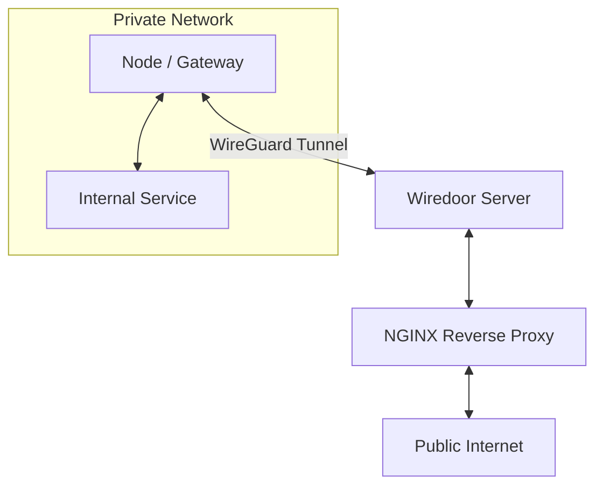

# Wiredoor Documentation

Welcome to the official documentation for **Wiredoor** — a self-hosted, open-source Ingress-as-a-Service platform that lets you expose local services from any private network 
— Docker containers, on-prem servers, even IoT devices — to the public internet, **without opening firewall ports or setting up reverse proxies manually**. Everything 
runs over a secure, encrypted reverse VPN tunnel powered by [WireGuard](https://www.wireguard.com).

Wiredoor acts as your own ingress controller, giving you full control and visibility over how external traffic 
reaches your services—whether they're running in Docker, Kubernetes, on-prem servers, industrial devices, or IoT setups.

---

## What is Wiredoor?

**Wiredoor** is a self-hosted ingress-as-a-service platform that enables you to securely expose internal services, devices, 
or infrastructure located in **private networks**, **LANs**, or **isolated environments** without needing to open firewall ports, 
configure public cloud load balancers, or deploy reverse proxies manually.

At its core, Wiredoor creates a **reverse VPN tunnel** using [WireGuard](https://www.wireguard.com), allowing your internal services 
to establish outbound, encrypted connections to the Wiredoor Server, which acts as a public ingress point. Once connected, 
traffic from the internet can be securely routed into your network via domain-based rules, without requiring any inbound access to your local environment.

### Core components

<<<<<<< Updated upstream
Wiredoor is composed of four main parts:

- [WireGuard](https://www.wireguard.com) VPN Server

Handles secure, encrypted tunnels between your private network and the public ingress server. All connected clients (called nodes) use this channel.

- [NGinx](https://nginx.org/) Reverse Proxy

Receives incoming internet traffic, and forwards it to the appropriate node and internal service based on the domain, port, or protocol.

- Admin Control Panel (Web UI + API)

Lets you easily manage connected nodes, assign domains, expose or hide services, and configure SSL certificates — all from a clean, modern UI.
=======
| Component      | Role                                                                 |
|----------------|----------------------------------------------------------------------|
| WireGuard VPN  | Establishes encrypted tunnel between nodes and server                |
| NGINX Proxy    | Routes incoming internet traffic to internal services                |
| Admin Panel    | UI + API to manage domains, nodes, and certificates                  |
| Wiredoor CLI   | Tool to register, connect, and expose services from your devices     |
>>>>>>> Stashed changes

- Wiredoor CLI

- Lightweight command-line tool designed to interact with the Wiredoor API from nodes directly.

### How is it different from traditional ingress or tunnels?

Most existing ingress solutions require:

- A cloud provider (e.g. AWS ELB, Cloudflare Tunnel, Azure VPN)
- Port forwarding on routers or firewalls
- Manual reverse proxy configuration
- Exposure of your private environment to the internet

**Wiredoor flips this model:**

Your services stay hidden in private networks. Only outbound WireGuard connections are needed. All ingress is managed from the outside, through a secure, 
authenticated VPN tunnel that you fully control.

---

## How it works?

1. Wiredoor runs on a public-facing server (with Docker or bare metal).
2. Nodes (clients or gateways) connect to Wiredoor over WireGuard.
3. Services running in private networks are securely exposed to the internet via domain/port routing.
4. SSL certificates are handled automatically (Let's Encrypt or self-signed).

---

## Key Features

- Secure and lightweight VPN via WireGuard
- Built-in NGINX reverse proxy
- Automatic SSL certificate provisioning (Let's Encrypt support)
- Expose HTTP, TCP, or UDP services
- Works with Docker, Kubernetes, legacy servers, IoT, and more
- Supports both single-node and gateway (site-to-site) modes
- CLI tools for automation and scripting
- No need to expose internal firewalls or use cloud services
- 100% Open Source and Self-Hosted

---

## Use Cases

- Expose websites and other services publicly
- Expose dashboards and dev environments remotely
- Access private services without opening firewall ports
- Connect remote Kubernetes clusters for development
- Provide secure ingress to industrial systems and IoT devices
- Act as a site-to-site VPN for full subnetwork routing

---

## Get Started

→ Ready to deploy? Continue to the [Installation Guide](/docs/installation)

---

## Community & Support

Wiredoor is built with ❤️ by INFLADOOR LLC.

If you have questions, suggestions, or want to contribute, 
feel free to open an [issue](https://github.com/wiredoor/wiredoor) or contact us via support@wiredoor.net.