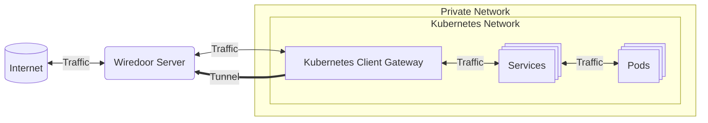

import { Callout } from 'nextra/components'

# Wiredoor Kubernetes Gateway

The **Wiredoor Gateway Helm Chart** allows you to securely expose services from **private Kubernetes clusters** to the public internet 
through Wiredoor — without the need for reverse proxies, bastion hosts, or cloud tunnels.

Wiredoor Gateway creates a **reverse VPN tunnel** using WireGuard and connects it to your self-hosted Wiredoor server. Once connected, 
you can expose any service from your cluster as HTTP or TCP/UDP, with automatic SSL support if using a public domain or self-signed certificate.

---

## Why use Wiredoor Kubernetes Gateway

Exposing a private Kubernetes cluster to the internet is a common challenge in modern infrastructure — especially in on-prem, 
air-gapped, or hybrid environments. Traditional methods often involve complex setups like bastion hosts, VPNs, 
or third-party cloud tunnels.

Each method comes with trade-offs in terms of security, setup complexity, and performance.

The following table compares popular options:

| Method                       | Security      | Complexity | Latency |
|------------------------------|---------------|------------|---------|
| Bastion + NGINX              | High          | Medium     | Low     |
| VPN (WireGuard/OpenVPN)      | Very High     | High       | Low     |
| Cloudflare Tunnel / Ngrok    | High          | Low        | Medium  |
| **Wiredoor Kubernetes Gateway**     | **Very High** | **Low**    | **Low** |

Wiredoor Kubernetes Gateway was designed with Kubernetes-native environments in mind. It integrates seamlessly with your cluster through a simple Helm chart, 
without requiring any changes to your existing workloads or network layout. By establishing a secure, low-latency tunnel from inside the cluster 
to a Wiredoor server, you gain full control over ingress without exposing your cluster to the public internet.


### When to use Wiredoor Gateway

- You want to expose services from a **private or on-prem Kubernetes cluster**
- Your cluster is behind a NAT, firewall, or in a **restricted network**
- You need a **secure alternative** to opening ports or running cloud tunnels
- You want to **automate ingress setup** with Helm and avoid manual proxies
- You need to **temporarily** or **permanently** expose services from Kubernetes
- You're looking for a **self-hosted**, open-source ingress solution with VPN-level security
- You want automatic SSL termination using Let's Encrypt or self-signed certificates

---

## How It works



1. You install the Wiredoor Kubernetes Gateway agent inside your cluster using Helm.
2. It connects to your public Wiredoor server over a WireGuard tunnel.
3. The server can now securely proxy traffic from the internet into your cluster.

## Requirements

- A running Wiredoor Server with public IP or domain
- Access to the target Kubernetes cluster (kubectl + Helm)
- The default service subnet of your cluster (usually 10.96.0.0/12)

## Configuration Steps

### 1. Identify your cluster's service subnet

Run:

```bash
kubectl -n kube-system get svc kube-dns -o wide
```

You’ll get something like `10.96.0.10`, meaning your service subnet is `10.96.0.0/12`.

### 2. Create a Gateway Node in your Wiredoor

- Log into the Wiredoor Web UI
- Create a new **node** and assign a name
- Select checkbox `Is Gateway` and define the gateway subnet (e.g. `10.96.0.0/12`)
- Copy generated token. You’ll use this in the Helm installation.

### 3. Install the Helm Chart

You can install it in any namespace. Default is 'default'.

```bash
helm repo add wiredoor https://charts.wiredoor.net

helm -n default install my-wiredoor-gateway wiredoor/wiredoor-gateway \
  --set wiredoor.server=https://your-wiredoor-server.com \
  --set wiredoor.token=your_gateway_node_token
```

<Callout type="info" emoji="🔧">
  The chart is compatible with Helm 3+ and works with any Kubernetes distribution.
</Callout>

### 4. Verify Connection

Check the Wiredoor Web UI to confirm that the gateway node shows as connected.

## Exposing Services

To expose a service from your cluster:

1. Go to the Wiredoor Web UI and Expose Service in your cluster gateway node.
2. Enter the backend protocol and **Service Host** in the following format:

```perl
{service}.{namespace}.svc.cluster.local
```
Example: `argocd-server.argocd.svc.cluster.local`

3. Define the **Backend Port** (the service's internal port)
4. Assign a **domain** (must point to your Wiredoor server)

Wiredoor will route incoming requests to your service through the VPN and apply SSL termination if the domain is public.

## Enhancing Security with Network Policies

The Helm chart for Wiredoor Gateway includes built-in support for **Kubernetes Network Policies**, 
allowing you to restrict what internal services the gateway can access.

This adds an extra layer of security — ensuring the gateway only routes traffic to explicitly allowed Pods or Namespaces.

The following example values Only allow access to ArgoCD server:

```yaml filename="values.yaml"
wiredoor:
  server: https://my-wiredoor.com
  token: your_gateway_token

networkPolicy:
  enabled: true
  egress:
    - podSelector:
        matchLabels:
          app.kubernetes.io/name: argocd-server
      namespaceSelector:
        matchLabels:
          kubernetes.io/metadata.name: argocd
```

This will ensure that only the argocd-server Pod in the argocd namespace can be reached by the Wiredoor Gateway Pod.

<Callout type="info" emoji="ℹ️">
  You can define multiple rules to allow access to more Pods or Namespaces.
</Callout>

<Callout type="info" emoji="💡">
  Use Network Policies to enforce **least privilege** — only allow access to services you intend to expose through Wiredoor.
</Callout>

## Notes & Limitations

- **DNS service resolution** is built-in. This allows Wiredoor to resolve Kubernetes service names such as `my-service.my-namespace.svc.cluster.local` without relying on the cluster DNS.
- You **must use fully qualified service names** when exposing services. Short names like `my-service` will not resolve correctly — use full service domain names (e.g., `api.default.svc.cluster.local`).
- **NetworkPolicies are built into the Helm chart**. You can restrict egress traffic from the Wiredoor Kubernetes Gateway Pod using `networkPolicy.egress` in the Helm values. This ensures the gateway can only reach specific Pods or Namespaces.
- The gateway only routes traffic to **services within the configured subnet**. Be sure to define the correct **service subnet** (e.g. `10.96.0.0/12`) when creating the gateway node in Wiredoor. This limits exposure to unintended parts of your cluster.
- The gateway Pod **must run in a namespace with access** to the services you intend to expose. If you use Network Policies or strict namespace isolation, adjust accordingly.
- The gateway runs as a regular Kubernetes Deployment — it does **not require privileged mode**, host networking, or elevated permissions.
- Wiredoor terminates **SSL connections automatically** using Let’s Encrypt (for public domains) or generates self-signed certs (for local/internal domains).

Following these best practices will ensure your Wiredoor Gateway is secure, efficient, and production-ready.
