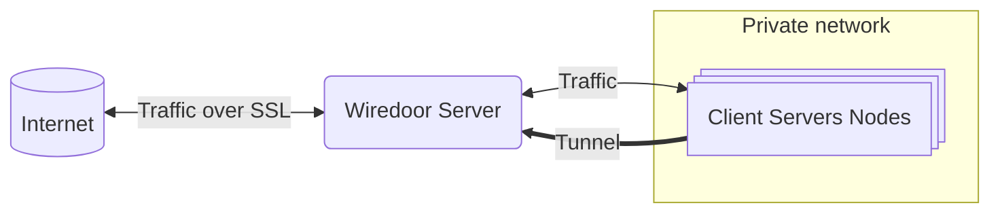
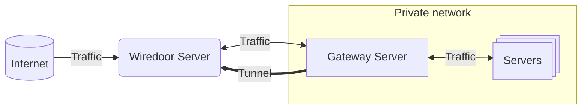

# Nodes in Wiredoor

**Nodes** are components that allow you to expose services to the internet through the Wiredoor Server. They represent the entry point for exposing services that live inside private networks, devices, or environments that are not directly reachable from the internet. There are three types of nodes in Wiredoor, each serving a different purpose:

- **Local Node**: Default special node that Exposes services running on the same server as Wiredoor, without creating a VPN tunnel.
- **Client Node**: Connects via a secure WireGuard tunnel and exposes services from remote devices.
- **Gateway Node**: Acts as a site-to-site VPN, routing traffic to entire subnets behind the node.

This document explains how each node type works, how to connect them, and how to manage them in the Web UI.

---

## Local Node

The **Local Node** is automatically created when the Wiredoor Server is installed. It does not use a WireGuard tunnel and **cannot be deleted or updated**.

It's designed to expose services running directly on the Wiredoor host machine through secure NGINX reverse proxy rules with SSL including the Wiredoor dashboard itself.

### Key Features

- Cannot be deleted
- Managed through the Web UI to expose local server services
- Supports custom domain and Let's Encrypt for Wiredoor dashboard

### Example Use Cases

| Service            | Description                                                                            |
| ------------------ | -------------------------------------------------------------------------------------- |
| Wiredoor Dashboard | Assign a domain and SSL to access your admin panel securely                            |
| Local Docker Apps  | Add containers to wiredoor docker-compose stack and expose those apps through wiredoor |

---

## Client Node

A Client Node connects to the Wiredoor Server via a secure WireGuard tunnel and allows services to be exposed from private devices.
These are the default type of nodes created from the Wiredoor dashboard unless explicitly specified as Gateway.

When you create a node in Wiredoor:

- A **WireGuard peer** is generated with a unique private key and assigned a static VPN IP (e.g. `10.12.1.3`).
- A **configuration file** is created, compatible with the official WireGuard client.
- An **API token** is issued, allowing the node to interact with Wiredoor using `wiredoor-cli`.

Once connected, the node can securely send and receive traffic through the Wiredoor Server.

---

## Connecting a Node

There are multiple ways to connect a node:

### 1. Manual Connection (Any OS)

After creating a node in the Web UI:

- Download the WireGuard configuration file (`.conf`)
- Import it into any [WireGuard client](https://www.wireguard.com/install/)
- Activate the connection

This gives you a working VPN tunnel between your node and Wiredoor.

### 2. Using `wiredoor-cli` (Recommended)

[Wiredoor CLI](https://github.com/wiredoor/wiredoor-cli) is a lightweight client built in Go that can:

- Establish and manage the WireGuard connection
- Interact with the Wiredoor API
- Automatically expose or hide services from the command line
- Optionally Keep your node connected with automatic health checks
- Detects and recovers from network issues and system restart

(See [CLI documentation](./cli) for details)

---

## Gateway Node

A **Gateway Node** is a special type of node that acts like a site-to-site VPN bridge. Instead of only exposing services on the node itself, it forwards traffic to any IP in its local subnet.

### Key Features

- Forward traffic to **any host** in its local subnet (e.g. `192.168.1.100`)
- Allow Wiredoor to route external traffic to **multiple internal devices**, not just the node

### Use cases

- Expose devices without WireGuard support (e.g. IoT, PLCs, cameras, printers)
- Access services running on other servers behind the same router
- Tunnel into Kubernetes or Docker networks

When creating or editing a gateway node, you can define which subnets it can route traffic to.

---

## Node Lifecycle

Each node (except the Local Node) can be:

- 🟢 **Connected** — VPN tunnel is active and services can be exposed
- 🟠 **Idle** — Tunnel is up, but the Wiredoor server cannot reach the node (e.g., ping fails or ICMP is blocked by a firewall)
- 🔴 **Disconnected** — VPN tunnel is disabled, services are not reachable
- ♻️ **Regenerated** — You can reset the WireGuard config and rotate the API token at any time
- 🗑️ **Deleted** — Permanently removes the node and all associated config

---

## Managing Nodes in the UI

From the Web UI, you can:

- View and manage node status
- Download the WireGuard config (for client/gateway)
- View or regenerate the API token
- Connect or disconnect the node
- View services currently exposed
- Expose or disable HTTP/TCP services
- View its VPN IP and connection status
- Configure domain and SSL

---

## Example Use Cases

| Use Case                        | Node Type     | Description                                                                           |
| ------------------------------- | ------------- | ------------------------------------------------------------------------------------- |
| Exposing a local dev server     | Standard Node | VPN tunnel from a laptop or VM                                                        |
| Self-hosted dashboard on a NAS  | Standard Node | Tunnel directly from the NAS device                                                   |
| Accessing an entire factory LAN | Gateway Node  | Route to multiple devices behind a router                                             |
| Publishing Kubernetes services  | Gateway Node  | Use Helm chart to tunnel from inside the cluster                                      |
| Headless IoT Device             | Gateway Node  | Expose a device that cannot run WireGuard directly (via another node on the same LAN) |

---

## Next Steps

- Use [`wiredoor-cli`](./cli) to connect and expose services
- [Expose services](./usage) from your connected nodes
- Deploy a [Docker Gateway](./docker-gateway) or [Kubernetes Gateway](./kubernetes-gateway)
