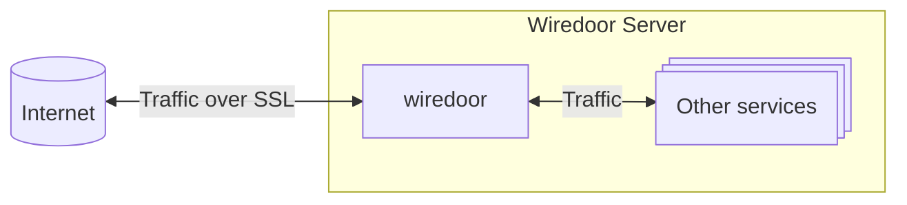
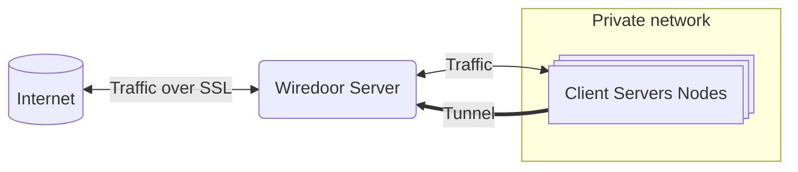
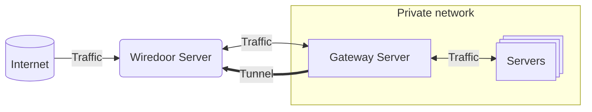

import { Callout } from 'nextra/components'

# Usage

Once Wiredoor Server is installed and running, you can start using the **Web UI** and the **Wiredoor CLI** to:

- Configure domains  
- Register and manage nodes  
- Expose internal services to the internet

This guide walks you through the most common tasks in a logical order.

---

## Domains

Domains define how traffic is routed from the public internet into your internal services.

<Callout type="info" emoji="💡">
  You can register as many domains as needed and map multiple services to each.
</Callout>

### Public Domains (Recommended)

- Must point to your Wiredoor server's public IP (via A/CNAME DNS record)
- Automatically get SSL certificates via Let’s Encrypt
- Ideal for production and public access

### Internal or Local Domains

- Do not require DNS registration (e.g. `dashboard.lan`, `test.internal`)
- Use self-signed certificates
- May trigger browser warnings unless trusted

### Enabling OAuth2 Authentication

You can enable authentication per domain directly from the Wiredoor dashboard. This allows you to restrict access to specific services under a 
domain using external identity providers like Google, GitHub, or any OIDC-compatible service. See the full list of supported providers in the 
[OAuth2 Proxy documentation](https://oauth2-proxy.github.io/oauth2-proxy/configuration/providers/).

Before enabling OAuth2 in the dashboard, you must define the following environment variables in your `.env` file and restart the Wiredoor server:

```env
OAUTH2_PROXY_PROVIDER=google
OAUTH2_PROXY_CLIENT_ID=your-client-id
OAUTH2_PROXY_CLIENT_SECRET=your-client-secret
```

Without these variables, the dashboard will not allow you to enable OAuth2 authentication.

#### How to enable

1. Navigate to the Domains section in the Wiredoor dashboard.
2. Select the domain where you want to enable authentication.
3. Check the box labeled Enable OAuth2 Authentication.
4. Fill the allowed emails.

You can protect specific services under this domain by checking **Require Authentication** when exposing them from the node.

<Callout type="warning" emoji="⚠️">
  When configuring your OAuth2 application in the provider’s dashboard, you must register the Redirect URI like `https://<your-domain>/oauth2/callback`
</Callout>

---

## Understanding Nodes

**Nodes** are devices or systems that expose services to Wiredoor.  
Most nodes establish a connection to the Wiredoor Server over a **WireGuard VPN tunnel** — with one exception: the **Local Node**.

### Types of Nodes

| Type             | Description |
|------------------|-------------|
| **Local Node**   | Runs on the same server as Wiredoor. It **does not use a WireGuard tunnel** and is used to expose services hosted directly on the Wiredoor server itself. |
| **Client Node**  | A remote system that connects to Wiredoor using a secure WireGuard tunnel and exposes services from that machine only. |
| **Gateway Node** | A remote system that acts as a site-to-site VPN, forwarding traffic for an entire subnet or container network. |

### Local Node

It's designed to expose services running directly on the Wiredoor host machine through secure NGINX reverse proxy rules with SSL including the Wiredoor dashboard itself.



#### Key Features

- Cannot be deleted
- Managed through the Web UI to expose local server services
- Supports custom domain and Let's Encrypt for Wiredoor dashboard

#### Example Use Cases

| Service | Description |
|---------|-------------|
| Wiredoor Dashboard | Assign a domain and SSL to access your admin panel securely |
| Local Docker Apps | Add containers to wiredoor docker-compose stack and expose those apps through wiredoor |

<Callout type="warning" emoji="⚠️">
  The Local Node is created automatically and **cannot be deleted or updated**.
</Callout>

### Client Node

A Client Node connects to the Wiredoor Server via a secure WireGuard tunnel and allows services to be exposed from private devices. 
These are the default type of nodes created from the Wiredoor dashboard unless explicitly specified as Gateway.

When you create a node in Wiredoor:

- A **WireGuard peer** is generated with a unique private key and assigned a static VPN IP (e.g. `10.12.1.3`).
- A **configuration file** is created, compatible with the official WireGuard client.
- An **API token** is issued, allowing the node to interact with Wiredoor using `wiredoor-cli`.

Once connected, the node can securely send and receive traffic through the Wiredoor Server.



### Gateway Node

A **Gateway Node** is a special type of node that acts like a site-to-site VPN bridge. Instead of only exposing services on the node itself, it forwards traffic to any IP in its local subnet.



### Key Features

- Forward traffic to **any host** in its local subnet (e.g. `192.168.1.100`)
- Allow Wiredoor to route external traffic to **multiple internal devices**, not just the node

### Use cases

- Expose devices without WireGuard support (e.g. IoT, PLCs, cameras, printers)
- Access services running on other servers behind the same router
- Tunnel into Kubernetes or Docker networks

When creating or editing a gateway node, you can define which subnets it can route traffic to.

---

## Managing Nodes (UI and CLI)

You can manage nodes via:

- **Web UI** → Go to the **Nodes** tab to create or delete nodes.
- **CLI** → Install the CLI on the node you want to register.

### Node Lifecycle

Each node (except the Local Node) can be:

- 🟢 **Connected** — VPN tunnel is active and services can be exposed
- 🟠 **Idle** — Tunnel is up, but the Wiredoor server cannot reach the node (e.g., ping fails or ICMP is blocked by a firewall)
- 🔴 **Disconnected** — VPN tunnel is disabled, services are not reachable

### Register a node via CLI:

```bash
wiredoor login --url https://your-wiredoor-ip-or-domain
```

This will prompt for:

- Admin credentials (email and password)
- Node Name (default: current hostname)
- Whether the node acts as a gateway
- Whether to route internet traffic (default: no)

---

## Exposing Services

Once your node is connected, you can expose services either via the **Web UI** or the **CLI**.

### Using CLI to expose HTTP Services

```bash
wiredoor http myapp --domain app.your.domain.com --port 3000
```

<Callout type="warning" emoji="⚠️">
  Make sure the domain used (e.g. `app.your.domain.com`) points to your Wiredoor server's public IP.
</Callout>

Options:

- `--path /subpath` — optional path to expose
- `--proto https` — use HTTPS to talk to backend (default: http)
- `--backendHost` — required if exposing from a gateway node
- `--allow` / `--block` — restrict access by IP or subnet

### Using the CLI to expose TCP/UDP services

```bash
wiredoor tcp ssh-access --port 22
```

Options:

- `--proto tcp|udp`
- `--ssl` — wrap traffic in TLS
- `--allowedIps` — allow list for security

## Monitor Access Logs (per domain or service)

Wiredoor allows you to monitor real-time access logs for each exposed service or domain.

### 🔎 From the Web UI

1. Go to the **Domains** or **Nodes** menu, If node select a node to see details and services.
2. Click the more button next to the domain or service you want to inspect and select **Logs Monitor**.
3. You'll see a live stream of incoming requests, including:
  - Timestamp
  - Client IP
  - Requested path
  - HTTP method and status code (for HTTP services)

<Callout type="info" emoji="💡">
  Logs can be used for debugging, auditing, or simply understanding traffic patterns.
</Callout>

### From the host system (optional)

If you mounted the NGINX log directory (`./wiredoor-logs`) when deploying Wiredoor, you can also watch logs from the terminal:

tail -f wiredoor-logs/app.your.domain.com/access.log

---

## Next Steps

- [CLI Reference](./cli.md)
- Deploy a [Docker Gateway](./docker-gateway.md) or [Kubernetes Gateway](./kubernetes-gateway.md)
